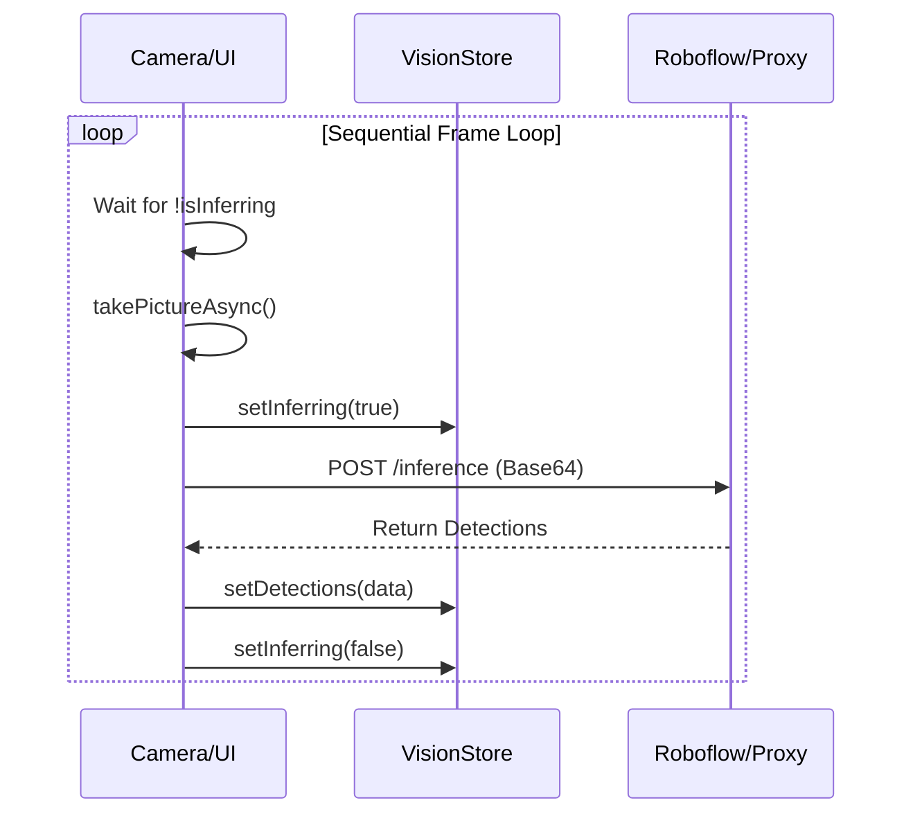
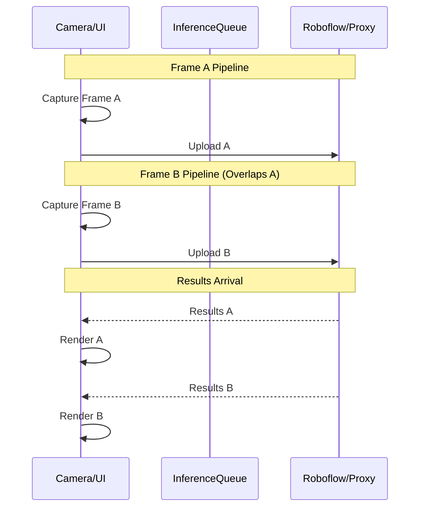

# Refactor: Manual Mode Pipelining

## Overview
Currently, Manual Mode (Server-based inference) operates on a strictly sequential loop. Each frame must be captured, uploaded, processed by the server, and returned before the next capture starts. This creates a "stop-and-go" visual experience with significant latency (300ms - 800ms) and low frame rates (1-3 FPS).

This refactor proposes a **Pipelined Architecture** for Manual Mode to decouple capture from inference, allowing multiple frames to be in flight simultaneously.

---

## 1. Current Sequential Architecture
The existing logic in `CameraScreen.tsx` uses a simple lock (`isInferring`):



### Bottlenecks:
1.  **Idle Camera**: The camera sits idle while the network request is in flight.
2.  **Network Blocking**: Total loop time = `CaptureTime + UploadTime + InferenceTime + NetworkRoundTrip`.
3.  **UI Latency**: The user sees "stale" boxes because the frame they were captured on has already passed by several hundred milliseconds.

---

## 2. Proposed Pipelined Architecture
We will implement a **Parallel Execution Pipeline** where the next frame capture starts immediately after the previous frame is sent, without waiting for the results.



### Key Changes:
1.  **Concurrency Control**: Replace the single `isInferring` boolean with an `inflightRequests` counter (up to a configurable limit, e.g., 2).
2.  **Request Identity**: Track which frame dimensions and timestamps belong to which request to avoid misalignment if results return out of order.
3.  **Cadence Throttling**: Use a fixed-interval timer (e.g., every 200ms) instead of a recursive wait-loop.

---

## 3. Implementation Plan

### Phase 1: Store Update (`src/store/useVisionStore.ts`)
*   Add `inflightCount: number` to state.
*   Update `setInferring` to increment/decrement instead of toggling.
*   Add a `maxConcurrentRequests` setting (default: 2).

### Phase 2: Hook Refactor (`src/hooks/useInference.ts`)
*   Modify `useMutation` to handle multiple concurrent calls.
*   Ensure `onSuccess` only updates the store if the result is the most recent (version/timestamp check).

### Phase 3: Loop Refactor (`src/components/CameraScreen.tsx`)
*   Remove the `!isInferring` check in the loop.
*   Implement a "Sliding Window" lock:
    ```typescript
    const loop = async () => {
      if (inflightCount < maxConcurrentRequests) {
        captureFrame(); // Non-awaiting
      }
      setTimeout(loop, 150); // Fixed 150ms cadence (~6-7 FPS target)
    };
    ```

---

## 4. Performance & Metrics

| Metric | Current (Sequential) | Proposed (Pipelined) |
| :--- | :--- | :--- |
| **Frame Rate** | 1 - 3 FPS | 5 - 8 FPS |
| **Effective Latency** | ~500ms | ~200ms (inter-frame) |
| **CPU Usage** | Low (mostly waiting) | Moderate |
| **Network Usage** | Bursty | Sustained / Parallel |

---

## 5. Risks and Trade-offs

### API Costs (Roboflow)
*   **Risk**: Pipelining will naturally result in more frames being processed per minute.
*   **Mitigation**: Implement a strict "Inference Per Second" (IPS) cap in the UI settings to allow users to trade cost for smoothness.

### Out-of-Order Results
*   **Risk**: Frame B might return before Frame A due to network variability.
*   **Mitigation**: Implement a `sequenceId` or `timestamp` check. If a newer result has already been rendered, discard the older incoming result.

### Device Heat
*   **Risk**: Multiple base64 encodings and uploads occurring in parallel will tax the CPU and Radio.
*   **Mitigation**: Limit concurrency to a maximum of 2-3 on mobile devices.

---

## 6. Future Expansion: Local Frame Buffering
Once pipelining is stable, we can implement **Visual Odometry** or **Temporal Tracking**. While waiting for the server to return "Car at X,Y", the local code can use the phone's gyroscope/accelerometer to "move" the previous boxes to compensate for phone movement, creating a zero-latency feel for server-side boxing.
